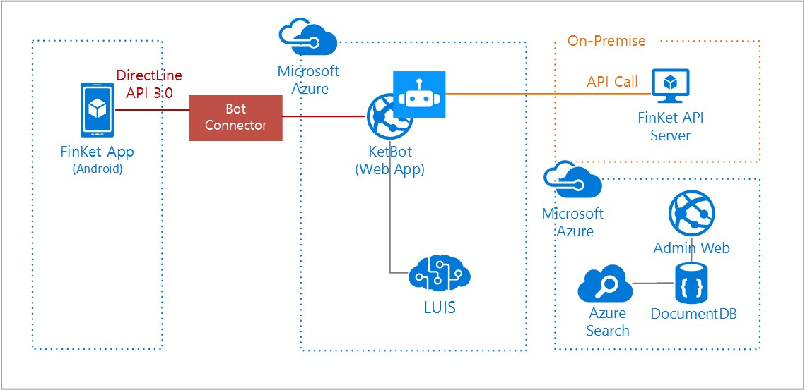

[매드업](http://madup.com/)은 2011년 설립된 마케팅 전문기업으로 [핀켓(FINKET)](https://play.google.com/store/apps/details?id=com.madup.pocket)이라는 Mobile Finance Service를 운영하고 있습니다. 핀켓 앱은 스마트폰의 잠금화면으로 신뢰성 있는 금융 기사와 포인트 통합 그리고 편리한 멤버십 적립과 개인 금융 서비스를, 광고주에게는 타겟 금융 광고 플랫폼을 제공합니다. 특히 카드 적립포인트나 상품권과 같이 현금처럼 사용할 수 있는 포인트를 다루기 때문에 고객들의 문의사항이 많은 편입니다. 

고객들의 문의사항이나 불만사항들을 분석하고 향후 일부 CS(Customer Satisfaction)업무를 챗봇을 통해서 지원하는 프로젝트를 이번 Hackfest를 통해서 검증해 보기로 하였습니다. Microsoft Bot Framework를 사용하여 챗봇을 구현하고 Microsoft Azure의 DocumentDB, Search 등의 기능을 백엔드에서 사용하여 데이터를 처리했습니다. 특히 고객들과의 자연스러운 채팅을 구현하기 위해 Microsoft Cognitive Services의 자연어 처리 서비스인 LUIS(Language Understanding Intelligent Service)를 사용했습니다. 

Hackfest 멤버
- 김국진: Madup, CTO
- 송우석: Madup, CDO
- 이봉진: Madup, Software Engineer
- 이주민: Madup, Software Engineer
- 오일석: Microsoft, Technical Evangelist
- 류혜원: Microsoft, Audience Evangelism Manager

## 고객사 ## 

MADUP은 2015년 설립 후 2016년에 30%의 매출 성장을 일으키며 빠르게 성장하고 있는 국내 1위 모바일 앱 퍼포먼스 마케팅 스타트업입니다. MAPUP은 사내에 역량이 뛰어난 데이터 사이언티스트와 개발진을 보유하고 있으며 비즈니스 분석 및 기획, 빅데이터 분석 능력을 갖추고 있습니다. 

현재 모바일 앱 마케팅 외에도 핀켓이라는 앱을 운영하고 있습니다. 핀켓 앱은 사용자에게 다양한 신용카드 포인트를 통합하여 사용할 수 있는 서비스를 제공하며 광고주에게는 타겟 금용 광고 플랫폼을 제공하고 있습니다. 한국 앱스토어의 라이프스타일 분야에서 다운로드 2위를 기록하였으며 Finance 분야에 다수 featured 되었습니다.

 
## 고객의 난제 ##

FinKet 앱을 통한 고객문의를 처리하는 방식은 아래 그림과 같습니다. 앱에서 고객이 "사용자 의견" 버튼을 누르면 제목과 내용을 입력할 수 있는 폼이 나옵니다. 고객이  내용을 입력하고 전송하면 먼저 데이터베이스에 저장되고 담당자가 전화, 이메일, 푸시알림 등을 이용하여 응답하는 방식입니다. 이런 프로세스는 보통 잘 작동되지만 업무시간이 지나면 응답을 할 수 없는 단점이 있습니다. 사실 별도 처리 프로세스가 필요없는 단순한 문의의 경우는 빠르게 응답 할 수 있음에도 시간이 걸리고 CS 담당자에게는 반복적인 작업이 됩니다. 특히 한명이 이미 여러가지 업무를 수행하고 있는 스타트업의 특성상 CS 업무는 모두에게 부담이 되는 업무가 되었고 가장 중요한 일임에도 불구하고 소홀이 다뤄지는 문제가 있습니다. 

따라서 챗봇을 통해서 단순한 문의에 대한 업무를 자동화하여 24시간 빠르게 대응하고 챗봇이 처리할 수 없는 업무에 대해서는 담당자에게 처리 요청이 가도록 프로세스를 개선할 수 있다면 고객과 직원이 모두 만족할 것입니다. 단순한 질문 외에도 서버스의 API를 점차 개선하여 포인트 조회, 사용내역 조회 등의 업무를 챗봇으로 이전하는 등 지속적인 개선이 가능할 것으로 예상됩니다. 
 
## Solution and steps ##

**기존 CS 데이터의 분석**

머신러닝 기법으로 기존 CS 데이터 중 약 2000건의 데이터를 분석

**LUIS 학습**

분석된 데이터를 기반으로 LUIS를 학습시키다. 

**챗봇 구현 및 데이터의 저장과 검색**

## Technical delivery ##
This section will include the following details of how the solution was implemented:

- Bot Patterns

- Core Bot Capabilities

- Bot Intelligence

	- Cognitive Services

	- Azure Search

- Technology Integration

	- Azure Storage, Compute or services

	- Microsoft Canvas, 3rd Party Channels

- SDKs used, languages, etc.

- Code artifacts

- Pointers to references or documentation

- Learnings from the Microsoft team and the customer team

*If you’d really like to make your write-up pop, include a customer quote that highlights the solution. Attribute all quotes with Name, Title, Company.*

 
## Conclusion ##

This section will briefly summarize the technical story with the following details included:

- Measurable impact/benefits resulting from the implementation of the solution.

- General lessons:

  - Insights the team came away with

  - What can be applied or reused for other environments or customers?

- Opportunities going forward:

  - Details on how the customer plans to proceed or what more they hope to accomplish

*If you’d really like to make your write-up pop, include a customer quote highlighting impact, benefits, general lessons, and/or opportunities.*

## Additional resources ##
In this section, include a list of links to resources that complement your story, including (but not limited to) the following:

- Documentation

- Blog posts

- GitHub repos

- Etc…