마케팅 전문 기업 [매드업](http://madup.com/)은 고객들의 문의사항이나 불만사항들을 수집하여 분석하고 있습니다. 이 데이터를 사용하여 고객지원 업무의 일부를 챗봇을 통해서 지원하는 프로젝트를 이번 Hackfest를 통해서 검증해 보기로 하였습니다. 이 챗봇의 이름은 KetBot이라고 붙였고 두가지 버전으로 구현을 했습니다. KetBot v1은 미리 만들어 놓은 질문과 답변을 3단계의 카테고리에 넣어놓고 고객이 카테고리를 선택해서 들어오면 답변을 얻을 수 있는 방식으로 구현하고, KetBot v2는 자연어 처리를 붙여 채팅 형식으로 구현했습니다. Microsoft Bot Framework를 사용하여 챗봇을 구현하고 Microsoft Azure의 Cosmos DB, Azure Search 등을 백엔드에서 사용하여 데이터를 처리했습니다. 특히 KetBot v2에서는 고객들과의 자연스러운 채팅을 구현하기 위해 Microsoft Cognitive Services의 자연어 처리 서비스인 LUIS(Language Understanding Intelligent Service)를 사용했습니다. 

Hackfest 멤버
- 김국진: Madup, CTO
- 송우석: Madup, CDO
- 이봉진: Madup, Software Engineer
- 이주민: Madup, Software Engineer
- 오일석: Microsoft, Technical Evangelist
- 류혜원: Microsoft, Audience Evangelism Manager

사용한 기술

Bot 
- Visual Studio 2017 / C# 
- [Bot Framework Template](http://aka.ms/bf-bc-vstemplate)
- [Bot Framework Emulator](https://docs.microsoft.com/en-us/bot-framework/debug-bots-emulator)

Android App 
- Eclipse 
- Java 
- Android ADT, GIT
- [Direct Line REST API 3.0](https://docs.botframework.com/en-us/restapi/directline3)

Azure 
- Azure Cosmos DB + Azure Serach 
- Azure SQL Database
- Azure Web App

## 고객사 ## 

[매드업](http://madup.com/)은 2011년 설립된 마케팅 전문기업으로 [핀켓(FINKET)](https://play.google.com/store/apps/details?id=com.madup.pocket)이라는 Mobile Finance Service를 운영하고 있습니다. 핀켓 앱은 스마트폰의 잠금화면에 신뢰성 있는 금융 기사와 포인트 통합 그리고 편리한 멤버십 적립과 개인 금융 서비스를 제공하고 광고주에게는 금융 광고 플랫폼을 제공합니다. 한국 앱스토어의 라이프스타일 분야에서 다운로드 2위를 기록하였으며 Finance 분야에 여러번 featured 되었습니다.
특히 카드 적립포인트나 상품권과 같이 현금처럼 사용할 수 있는 포인트를 다루기 때문에 고객들의 문의사항이 많은 편입니다.

 
## 고객의 난제 ##

현재 핀켓 앱에서 고객문의를 처리하는 방식은, 고객이 "사용자 의견" 버튼을 누르면 제목과 내용을 입력할 수 있는 폼이 나오고 내용을 입력한 후 전송하면 담당자가 전화, 이메일, 푸시알림 등을 이용하여 응답하는 방식입니다. 이런 프로세스는 잘 작동되지만 업무시간이 지나면 응답을 할 수 없는 단점이 있습니다. 사실 별도 처리 프로세스가 필요없는 단순한 문의의 경우는 빠르게 응답 할 수 있음에도 불구하고 고객에게는 시간이 오래 걸리고, CS 담당자에게는 반복적인 작업이 됩니다. 특히 한명이 이미 여러가지 업무를 수행하고 있는 스타트업의 특성상 CS 업무는 모두에게 부담이 되는 업무가 되었고, 가장 중요한 일임에도 불구하고 소홀이 다뤄지는 문제가 있습니다. 

따라서 챗봇을 통해서 단순한 문의에 대한 업무를 자동화하여 24시간 빠르게 대응하고 챗봇이 처리할 수 없는 업무에 대해서는 담당자에게 처리 요청이 가도록 프로세스를 개선할 수 있다면 고객과 직원이 모두 만족할 것입니다. 단순한 질문 외에도 서버스의 API를 점차 개선하여 포인트 조회, 사용내역 조회 등의 업무를 챗봇으로 이전하는 등 지속적인 개선이 가능할 것으로 예상됩니다. 
 
## Solution and steps ##

### KetBot v1 ###

#### CS 데이터의 분석 ####
KetBot v1에서는 사람의 직관으로 데이터를 분석했습니다. 그 동안 서비스를 운영하면서 쌓아놓은 약 2000건의 고객의 질문과 답변 중에서 가장 빈도가 높은 질문을 뽑아서 3단계 카테고리로 정의했습니다. 최종 질문과 그 질문에 적합한 답변 데이터도 준비를 해서 엑셀로 만들고 Azure SQL Database에 저장했습니다. 

고객이 "포인트 통합 > 포인트 통합오류 > 보안문자"를 선택하면 "보안문자 입력이 안되고 오류가 있습니다" 라는 질문이 선택되고 이 질문에 대한 준비된 답변을 고객에게 보여주는 방식입니다. 답변은 같은 내용이지만 3가지 버전으로 준비해서 조금이라도 사람의 느낌을 주려고 노력했습니다. 

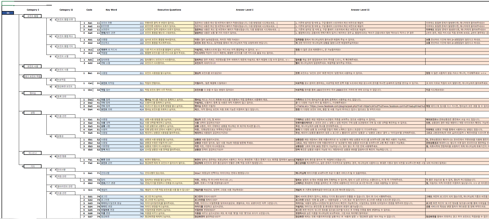

#### KetBot v1 아키텍쳐 ####

KetBot은 기존 핀켓앱에 통합되어 배포가 될 예정이기 때문에 Microsoft Bot Framework가 지원하는 Skype, Facebook Messenger등의 채널을 사용하지 않고 Android 기반의 앱을 직접 개발하기로 결정했습니다. Bot Connector와 연결을 위해서 Direct Line이라는 채널을 사용했습니다. Direct Line은 REST 방식의 API로 인증을 하고 대화를 주고 받는 API를 제공 합니다. 

사용자는 Android앱을 통해서 메시지를 입력하여 Bot에 전달하거나 Bot이 전달 해준 메시지를 받습니다. 사용자가 입력한 메시지는 Direct Line REST API를 통해서 Bot Connector에 전달 되고 Bot Connector는 해당 대화에 메시지를 전달 합니다. Bot은 적절한 질문과 대답을 데이터베이스에서 조회해서 사용자에게 전달합니다. Bot은 Azure Web App 에 배포해서 운영하고 데이터 베이스는 Azure SQL Database를 사용합니다. 

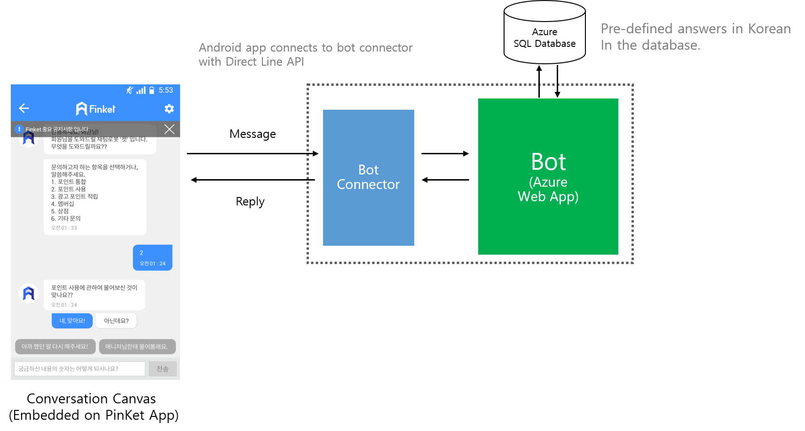

#### KetBot v1의 Dialog 흐름 ####

HackFest의 결과물인 소스코드는 오픈소스로 [Github](https://github.com/MadupPinket/ket-bot) 에 공개 되어 있습니다. Bot Builder SDK의 가장 핵심적인 코드는 바로 IDialog 인터페이스를 상속받은 Dialog 클래스들 입니다. FINKET Bot 에서는 5개의 Dialog를 체인으로 연결해서 대화의 흐름을 만들어 냈습니다. 

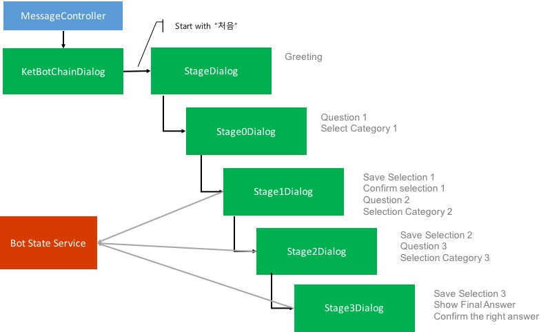

Microsoft Bot Framework의 기본 설계 철학 중 하나는 Stateless 입니다. 따라서 대화 중에 저장되어야 하는 상태 값들은 모두 Bot State Service에 저장해서 Bot 자체는 상태를 가지고 있지 않도록 해야만 합니다. 그러면 Bot을 호스팅하고 있는 웹앱을 여러 대로 늘리는 Scale Out을 해도 문제가 발생하지 않습니다. 

KetBot v1 작동영상 

<p><a href="https://youtu.be/iUrwiaHB7p4" target="_blank"></a></p>

### KetBot v2 ###

### 기존 CS 데이터의 분석 ###

KetBot v2에서는 약 2000건의 CS 데이터에서 유효한 핵심어들을 추출하는 과정이 먼저 진행되었습니다. 가공하지 않은 CS 데이터를 사용해서 LUIS를 학습 시키기는 어렵기 때문에 학습을 위한 데이터가 먼저 추출되어야 합니다. 이를 위하여 각 문장이 가진 단어의 패턴과 유형을 다양한 자연어처리, 머신러닝 기법을 이용하여 찾아내며, 그 결과로 나온 핵심 단어들을 문장으로 재구성 했습니다. 재구성 된 문장의 정합성을 체크하는 backward, forward test를 거쳤습니다. 이 과정을 통과한 단어가 곧 LUIS에서 사용할 Entity 와 Feature이며 단어들이 모여 구성한 집합은 각각 하나의 Intent를 형성합니다. 분석에 R 을 사용하였고 최종 정리는 엑셀을 활용 했습니다. 

**핵심단어 클러스터링**

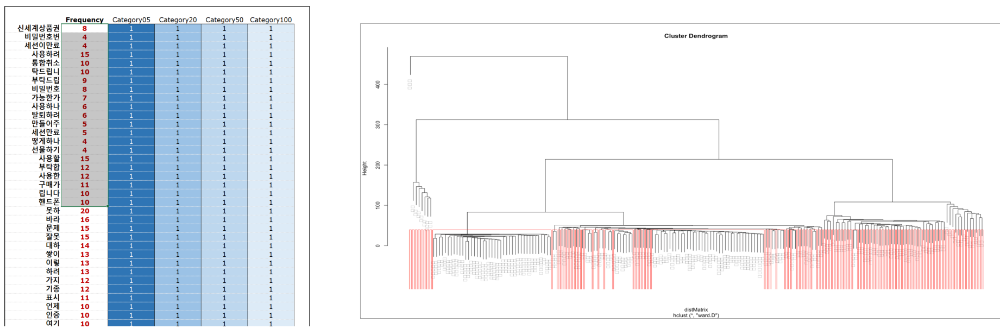

**backward + forward test table**

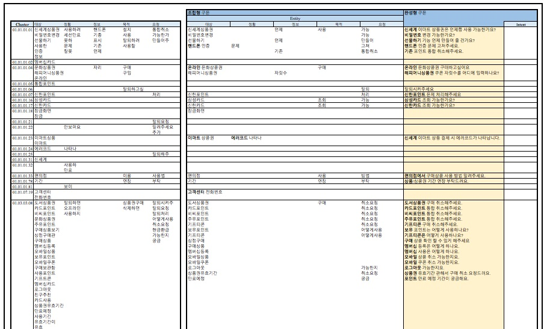

**최종적으로 산출된 IEQA(Intent-Entity/Question-Answer) Matrix**

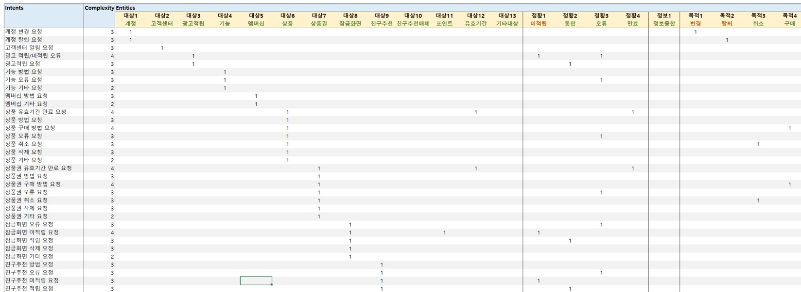

#### LUIS 학습 ####

분석된 데이터를 기반으로 LUIS를 학습 시켰습니다. 총 43개의 Intent와 25개의 Entity가 정의 되었습니다. 기존 확보된 2000개의 고객데이터를 직접 사용해서 학습 시키기 위해 API를 통해서 2000개를 모두 요청하고 Suggested Utterances 에 들어온 데이터를 이용해서 하나씩 학습을 진행했습니다. 

LUIS Intent, Entity
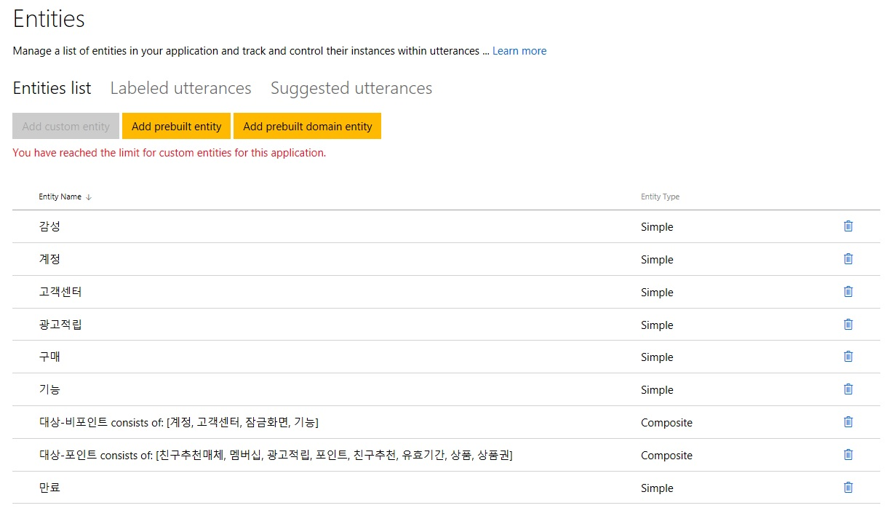

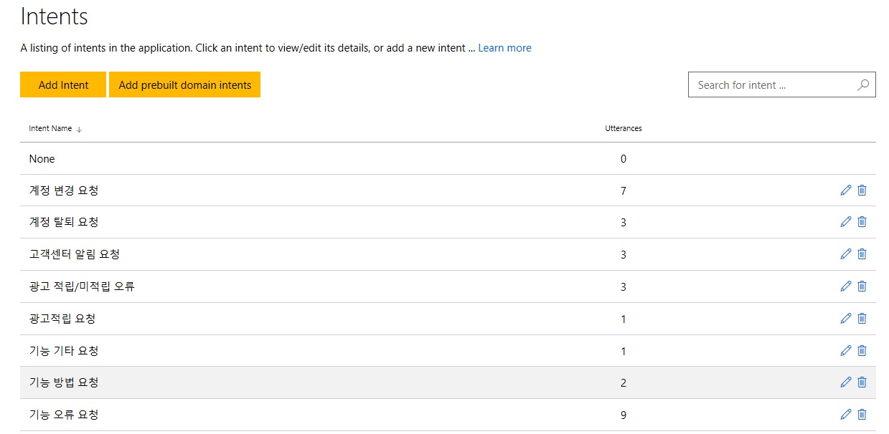

#### KetBot v2 아키텍쳐 ####

KetBot v2에서 추가된 부분은 LUIS의 사용입니다. 사용자의 메시지는 LUIS로 요청되어 Intent를 받아오고 Entity를 통해서 검색어를 추출합니다. KetBot v2에서는 검색엔진을 사용했습니다. 데이터는 Azure Cosmos DB를 DocumentDB API로 만들어서 질문과 대답을 넣어서 인덱싱하여 준비하고 KetBot의 검색 요청에 응답합니다. 포인트 조회등의 Intent는 Finket API를 통해서 포인트를 조회해서 응답합니다. 

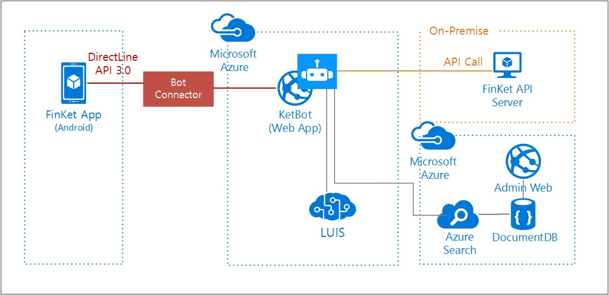

## Technical delivery ##

### Android 앱에서 Direct Line API 3.0 적용 

Android 앱에서는 DirectLine API 3.0을 통해서 Bot Connector와 통신하는 부분이 핵심 코드고 나머지는 채팅 UI를 만들어 내는 부분입니다. 향후 핀켓 앱에서는 고객지원 버튼을 누르면 채팅창이 뜨는 형식으로 통합될 예정입니다. 

**Authentication**

REST API이기 때문에 [Postman](https://chrome.google.com/webstore/detail/postman/fhbjgbiflinjbdggehcddcbncdddomop) 같은 툴을 사용하면 API 테스트하기 쉽습니다. API를 사용하기 위해서는 인증을 거쳐서 토큰을 얻어와야 합니다. 얻어온 토큰은 헤더에 추가해서 인증을 합니다. 

- URL: https://directline.botframework.com/v3/directline/tokens/generate 
- Method: POST
- Header: Authentication: Bearer {secret key from dev portal}
- body: 없음. 

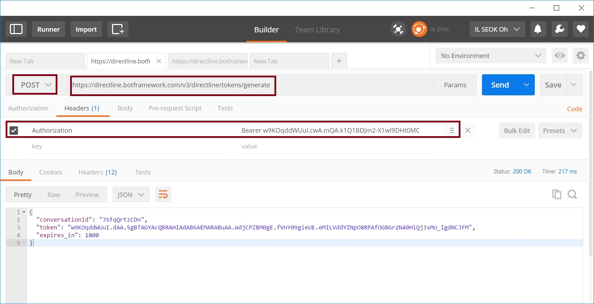

**Conversation ID 획득**

Postman으로 테스트한 API는 Android 앱에서 에서 코드로 구현했습니다. Coversation ID를 획득하는 과정은 새로운 대화를 시작하는 과정 입니다. 그 후 메시지를 보내고 받아오는 코드도 유사합니다. 

``` java
HttpPost httppost = new HttpPost(rootUrl + "directline/conversations");
httppost.setHeader("Authorization", "Bearer " + secretid);
			   
ResponseHandler<String> responseHandler = new BasicResponseHandler();
String responseBody = null;
responseBody = httpclient.execute(httppost, responseHandler);
				
JSONObject jobject = null;
			   
jobject = new JSONObject(responseBody);
token = jobject.getString("token");
conversationId = jobject.getString("conversationId");
streamUrl = jobject.getString("streamUrl");
```
**메지지 전송(startMessage)**

``` java
HttpPost httppost;
httppost = new HttpPost(rootUrl + "directline/conversations/" + conversationId +"/activities");
JSONObject json = new JSONObject();
			   
json.put("text", text);
json.put("type", "message");
json.put("from", (new JSONObject().put("id","bjlee")));
StringEntity params = new StringEntity(json.toString(), HTTP.UTF_8);
				
httppost.setHeader("Authorization", "Bearer " + token);
httppost.setHeader("Content-Type", "application/json");
httppost.addHeader("Authorization", "Bearer " + token);
httppost.addHeader("Content-Type", "application/json");
			
httppost.setEntity(params);
```

**메시지 수신(getMessage)**

``` java
HttpGet httppost;
httppost = new HttpGet(rootUrl + "directline/conversations/" + conversationId +"/activities?watermark=" + watermark);
JSONObject json = new JSONObject();
			
httppost.setHeader("Authorization", "Bearer " + token);
httppost.setHeader("Content-Type", "application/json");
httppost.addHeader("Authorization", "Bearer " + token);
httppost.addHeader("Content-Type", "application/json");
			
ResponseHandler<String> responseHandler = new BasicResponseHandler();
String responseBody = null;
			   
responseBody = httpclient.execute(httppost, responseHandler);
```
챗봇에서 응답을 받아보면 아래와 같습니다. 보내고 받은 메시지에도 ID가 부여 된 걸 알 수 있습니다. 시간과 채널에 대한 정보와 Bot의 이름 정보도 응답 메시지에 들어 있습니다.  여기서 중요한 값이 하나 오는데 바로 Watermark라는 값입니다. 이 값은 메시지를 보낼 때 마다 단순 증가합니다. 메시지를 받기 위해 GET 요청을 할 때 watermark 라는 Query String을 붙여주지 않으면 응답으로 해당 대화의 전체 히스토리를 다 전달 해줍니다. 메시지를 100번 주고 받았다면 100개의 과거 메시지가 다 전달됩니다. 이 때 Watermark 값을 GET 요청에 Query String으로 전달해 주면 해당 watermark 이후의 메시지만 응답으로 주기 때문에 더욱 효율적인 통신을 할 수 있습니다.
``` json
{
  "activities": [
    {
      "type": "message",
      "id": "3Dk2pLyFLvc|000000000000000004",
      "timestamp": "2016-12-02T12:18:51.0051607Z",
      "channelId": "directline",
      "from": {
        "id": "ketbotv2",
        "name": "ketbotv2"
      },
      "conversation": {
        "id": "3Dk2pLyFLvc"
      },
      "text": "You sent 안녕하세요! which was 6 characters",
      "replyToId": "3Dk2pLyFLvc|000000000000000003"
    }
  ],
  "watermark": "4"
}
```

### State 저장소

사용자와 Bot의 대화를 이어갈때 대화의 상태 정보를 저장해야 할 때가 있습니다. 상태 정보는 Bot Framework에서 제공하는 State 저장소에 저장을 해야 합니다. 저장소는 User, Coversation, Private Conversation에 의해 구분되어 저장됩니다. 대화는 여러명이 같이 진행할 수 있으니 그 대화의 상태는 coversation에 저장하고 각 개인의 상태 정보는 Private Conversation에 저장합니다. 

데이터 가져오기
- GetUserData()
- GetConversationData()
- GetPrivateConversationData()

데이터 저장
- SetUserData()
- SetConversationData()
- SetPrivateConversationData()

``` c#
[Serializable]
public class Stage2Dialog : IDialog<string>
{
   public async Task StartAsync(IDialogContext context)
   {
        // get state 
        KetBotState state = null;
        context.ConversationData.TryGetValue("KetBotState", out state);
        if (KetBotState == null) return;

        // save state
        context.ConversationData.SetValue("KetBotState", state);
   }
}
```

### 답변의 검색

질문과 대답 정보는 데이터 베이스에 저장됩니다. Azure Cosmos DB에 담긴 데이터의 형태는 아래와 같습니다. 
```json
{
    "answer": "로그아웃을 원하시나요? \n로그아웃은 '핀켓 앱 실행' > '사용자설정' > '나의 정보' 에 들어가셔서 로그아웃 버튼을 누르시면 된답니다. ",
    "keywords": [
      "로그아웃",
      "로그 아웃",
      "방법",
      "방안",
      "어떻게",
      "어떤"
    ],
    "intent": "기능 방법 요청",
    "id": "D0202",
    "title": "로그아웃 방법",
    "attachments": null
  }
```
이 데이터를 이용해서 Azure Search에 인덱스를 만드는 것은 Azure Portal에서 가능합니다. 만드는 방법은 [포털에서 첫번째 Azure Search 인덱스를 만들고 쿼리](https://docs.microsoft.com/ko-kr/azure/search/search-get-started-portal)문서를 참조하면 됩니다. 

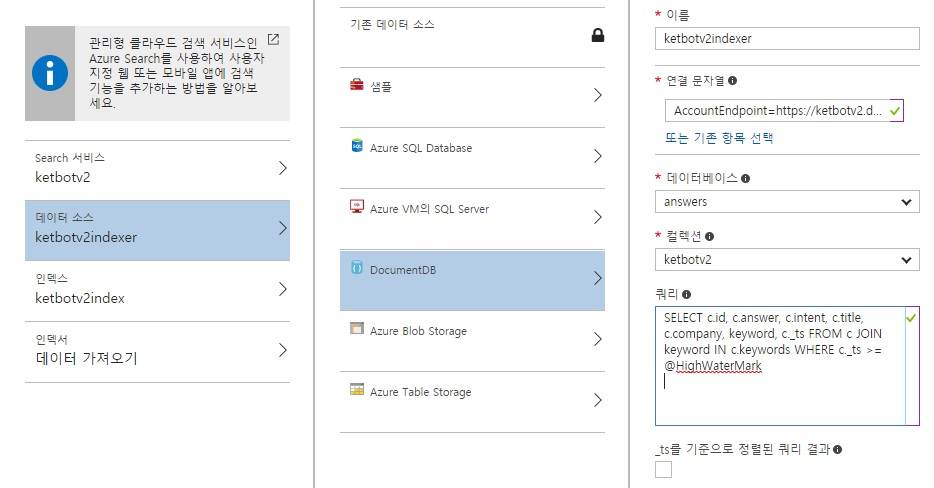

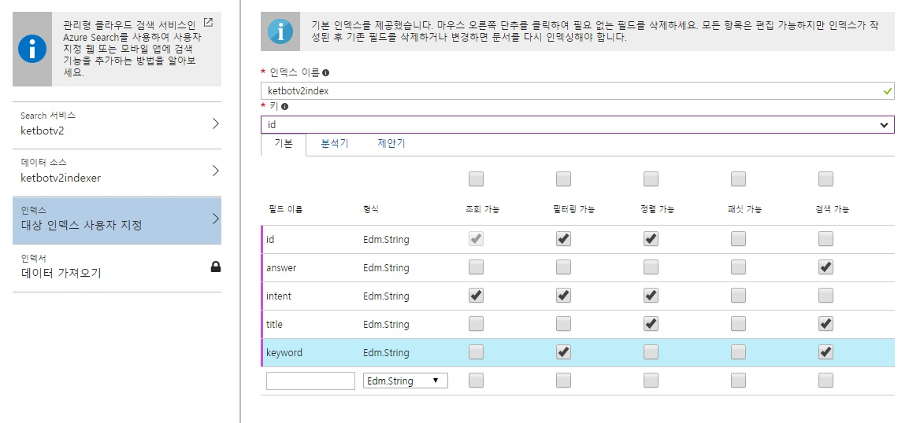


## Conclusion ##

3단계의 카테고리를 선택하여 최종 답변을 얻어내는 KetBot v1의 방식은 오류없이 잘 작동하고 CS 업무를 대체할 수 있습니다. 하지만 대화라는 느낌이나 챗봇의 느낌이 나지는 않습니다. LUIS를 이용해서 자연어 처리를 붙인 것이 더 자연스러운 느낌이 나고 향후 질문과 답변이 많아졌을 때 확장에 용이합니다. 하지만 사용자들의 메시지로 부터 Intent와 Entity를 얻어내려면 LUIS의 학습을 잘 시켜야 합니다. LUIS의 학습을 위해서 사전에 데이터 분석을 해서 의미 있는 데이터를 얻어 냈지만 LUIS의 특성을 잘 살리지는 못해서 인식이 완벽하지는 않습니다. 지속적으로 LUIS를 학습시켜서 인식률을 높이는 작업이 뒤따라야 할 것 같습니다. 

이번 HackFest를 통해서 챗봇을 구현했고 미래를 보았습니다. 사실 핀켓의 서비스 전체가 챗봇으로 구현이 되는 것이 핀켓의 최종 목표가 될 것 같다는 생각이 들었습니다. 챗봇과의 대화를 통해서 포인트를 적립하고 적립된 포인트로 상품을 구매할 수 있도록 하는 것이 핀켓의 미래이고 그 미래를 머지 않아 구현할 수 있겠다는 확신이 들었습니다. 

## Additional resources ##

- [KetBot v1 데모 영상](https://www.youtube.com/watch?v=iUrwiaHB7p4)
- [KetBot v1 source code](https://github.com/MadupPinket/ket-bot)
- [KetBot v2 source code](https://github.com/MadupPinket/ket-bot-v2)
- [Direct Line REST API 3.0(한국어)](https://blogs.msdn.microsoft.com/eva/?p=12625)
- [Dialog를 사용하여 대화의 흐름 만들기(한국어)](https://blogs.msdn.microsoft.com/eva/?p=12625)
- [상태저장을 위한 Bot State Service(한국어)](https://blogs.msdn.microsoft.com/eva/?p=12715)